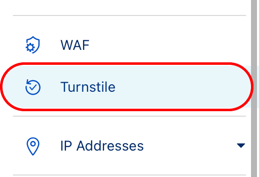
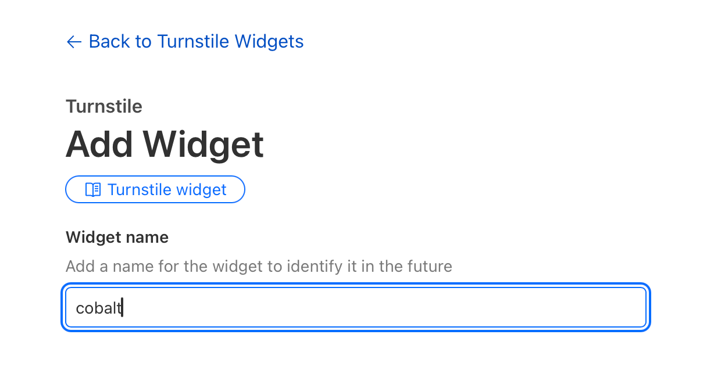
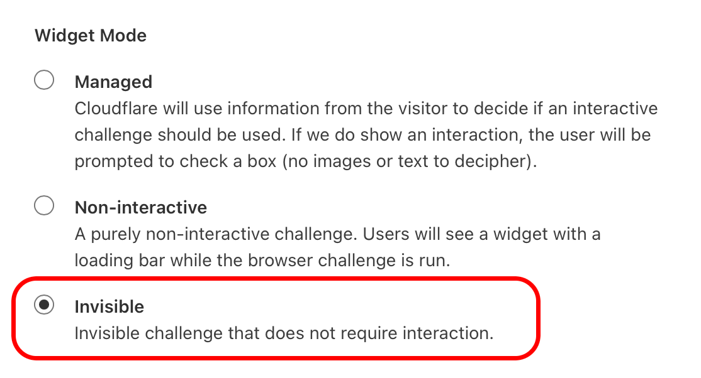
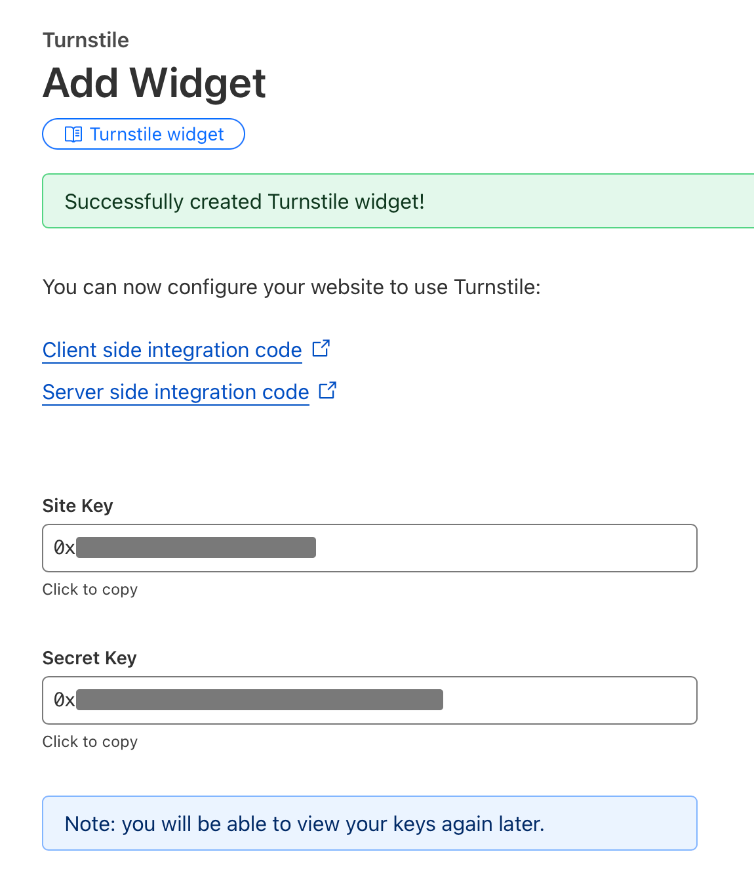

# how to protect your cobalt instance
if you keep getting a ton of unknown traffic that hurts the performance of your instance, then it might be a good idea to enable bot protection.

```
⚠️ this tutorial will work reliably on the latest official version of cobalt 10. we can't promise full compatibility with anything else.
```

## configure cloudflare turnstile
turnstile is a free, safe, and privacy-respecting alternative to captcha.
cobalt uses it automatically to weed out bots and automated scripts.
your instance doesn't have to be proxied by cloudflare to use turnstile.
all you need is a free cloudflare account to get started.

cloudflare dashboard interface might change over time, but basics should stay the same.

1. open [the cloudflare dashboard](https://dash.cloudflare.com/) and log into your account.
2. once logged in, select `turnstile` in the sidebar.

3. press `add widget`.

4. enter the widget name (can be anything, such as "cobalt").

5. add cobalt frontend domains you want the widget to work with. you can change this list later at any time.
    - if you want to use your processing instance with [cobalt.tools](https://cobalt.tools/) frontend, then add `cobalt.tools` to the list.

6. select `invisible` widget mode.

7. press `create`.
8. keep the page with sitekey and secret key open, you'll need them later.
if you closed it, no worries!
just open the same turnstile page and press "settings" on your freshly made turnstile widget.
**never share your secret turnstile key with anyone.**


you've successfully created a turnstile widget! time to add it to your processing instance.

### enable turnstile on your processing instance
this tutorial assumes that you only have `API_URL` in your `environment` variables list.
if you have other variables there, just add new ones after existing ones.
**example values in the tutorial should never be used**.

1. open your `docker-compose.yml` config file in any text editor of choice.
2. copy the turnstile sitekey & secret key and paste them to their respective variables. `TURNSTILE_SITEKEY` for the sitekey and `TURNSTILE_SECRET` for the secret key:
```yml
environment:
    API_URL: "https://your.instance.url.here.local/"
    TURNSTILE_SITEKEY: "2x00000000000000000000BB" # use your key
    TURNSTILE_SECRET: "2x0000000000000000000000000000000AA" # use your key
```
3. generate a `JWT_SECRET`. we recommend using an alphanumeric collection with a length of at least 64 characters. this string will be used as salt for all JWT keys. **do NOT use the example secret**.

```yml
environment:
    API_URL: "https://your.instance.url.here.local/"
    TURNSTILE_SITEKEY: "2x00000000000000000000BB" # use your key
    TURNSTILE_SECRET: "2x0000000000000000000000000000000AA" # use your key
    JWT_SECRET: "bgBmF4efNCKPirDqTc4FMmbX8P22I31oCj5R1zDiDi5sy8CWPnfLUct7rk5RlZUS" # create a new secret, NEVER use this one
```
